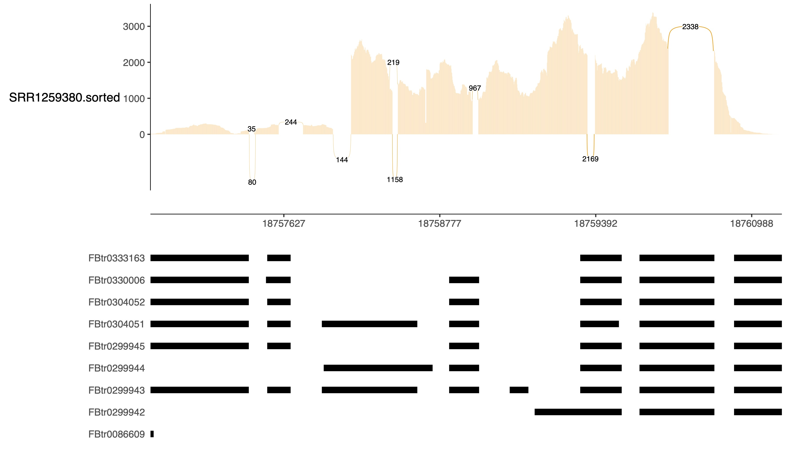
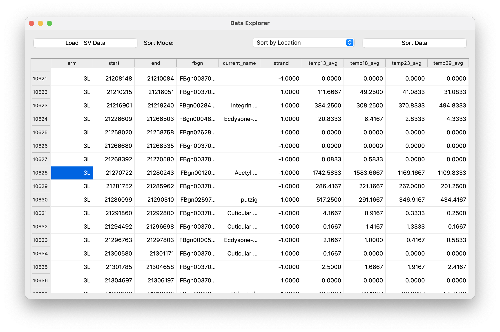
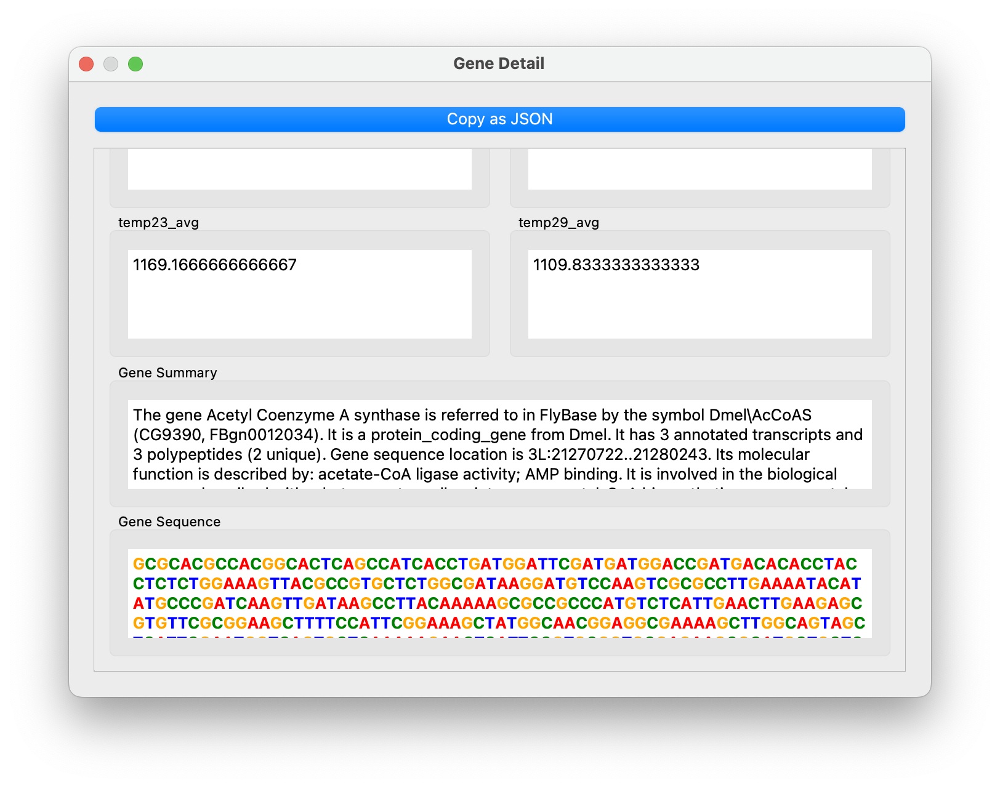

# Analysis on Temperature induced Expression of Genes in Drosophila

## Overview

This repository contains scripts and data for analyzing the temperature-induced expression of genes in Drosophila. The analysis includes processing gene expression data, performing statistical analysis, and visualizing the results.

## Getting Started

### Prerequisites

- Python 3.x
- Required Python packages (listed in `requirements.txt`)

### Installation

1. Clone the repository:
    ```sh
    git clone https://github.com/yourusername/droso.git
    cd droso
    ```

2. Install the required Python packages:
    ```sh
    pip install -r requirements.txt
    ```

### Running the Analysis

To run the analysis scripts, use the following commands:

1. Basic analysis:
    ```sh
    python analysis/analysis.py
    ```

2. Improved analysis with error handling:
    ```sh
    python analysis/analysis_v2.py
    ```

3. Concurrent processing for large datasets:
    ```sh
    python analysis/analysis_v2.5.py
    ```

### Sashimi Processing

The Sashimi processing workflow involves generating Sashimi plots to visualize splicing events in RNA-seq data. Follow these steps:

1. Run the Sashimi processing script:
    ```sh
    bash sashimi/sashimi.sh
    ```

2. The script will perform the following steps:
    - Download and unzip the reference genome
    - Build the HISAT2 index
    - Perform quality control on the FASTQ file
    - Align reads using HISAT2
    - Convert SAM to BAM
    - Sort and index the BAM file
    - Download and prepare the GTF annotation
    - Generate the Sashimi plot using `ggsashimi`

For more detailed information, refer to the specific scripts and data files in the repository.
- [HISAT2 Alignment Workflow for Drosophila Sashimi Plot](database/index/index.md)
- [Sashimi Workflow](sashimi/workflow.md)
- [Sashimi Command](sashimi/command.md)

### Data Explorer

The Data Explorer application allows you to visualize and interact with the gene expression data.

1. Run the Data Explorer (Python version):
    ```sh
    python explorer/explorer_v3.py
    ```

2. Run the Data Explorer (C++ version):
    ```sh
    cd explorer/app
    qmake && make
    ./DataExplorer
    ```

### Directory Details

- **analysis/**: Contains the main analysis scripts and changelog.
- **data/**: Contains raw data files used for analysis.
- **database/**: Contains database files for gene annotations and synonyms.
- **explorer/**: Contains the Data Explorer application for visualizing data.
- **function/**: Contains utility functions used in the analysis.
- **output/**: Contains the output files generated by the analysis scripts.
- **sashimi/**: Contains scripts and resources for generating Sashimi plots.

## Results

The results of the analysis are saved in the `output` directory.

**sashimi plot for gene `CG42351`**:

This is a sashimi plot showing the splicing events for the gene `CG42351` in Drosophila (data from SRR1259380).

## Release
Latest release is 0.2.5 of data explorer application. It is built using C++ and Qt framework and compiled for MacOS with M series processors. You can compile it for your system by downloading the source code. To download the Mac application, go to the release page here: [Data Explorer Release](https://github.com/Eric-xin/drosophila-tem-exp/releases/tag/data_explorer)

## Image



## License

This project is licensed under the MIT License - see the [LICENSE](LICENSE) file for details.

## Acknowledgments

- FlyBase for providing gene annotation data.
- The Drosophila research community for their valuable contributions.

For more detailed information, refer to the specific scripts and data files in the repository.